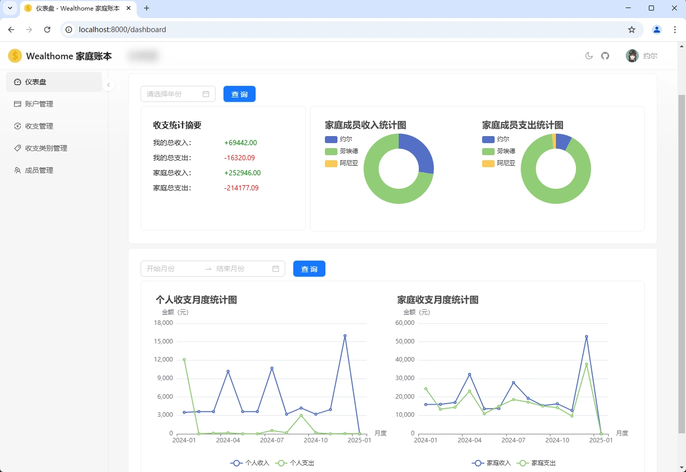
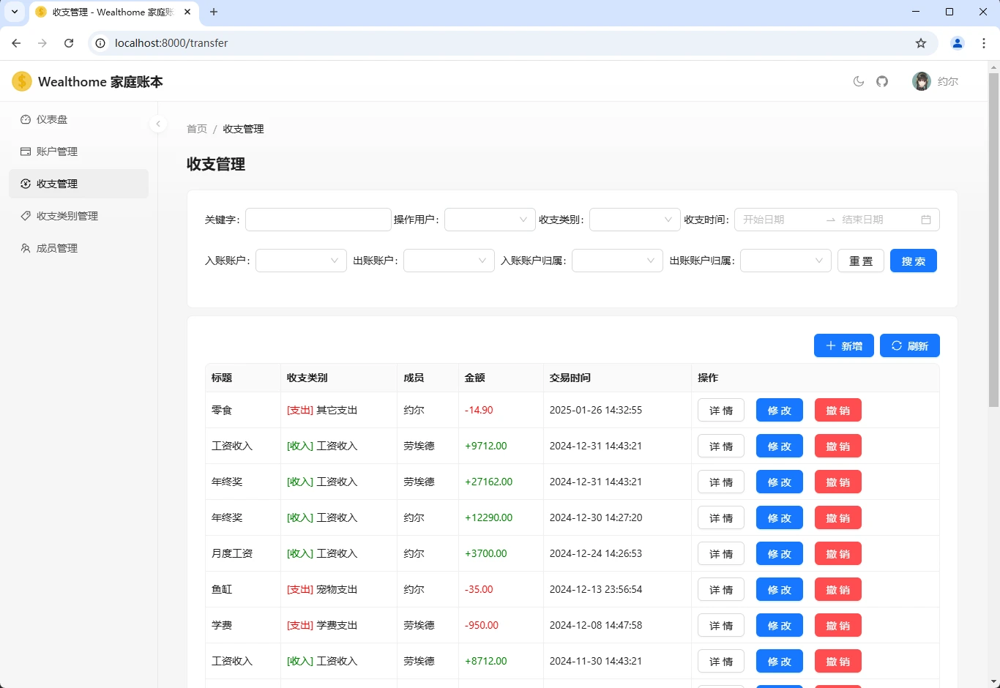

# Wealthome 家庭账本

一个简单的支持单人和多个家庭成员录入收支信息并汇总分析的账本工具，可以部署在轻量级云服务器、NAS或树莓派上。

* **前端**：React
* **后端**：ASP.NET Core 6
* **数据库**：SQLite 3

## 功能

1. 单人/多家庭成员支持：支持多个家庭成员使用不同账户录入和管理收支信息。
2. 复式记账：类似BeanCount的双向收支信息记录，能够跟踪多个账户的变化。
3. 报表统计：通过图表展示家庭收支情况。

## 截图

<div style="display: flex; justify-content: space-between; gap: 10px;">


</div>

## 使用Docker部署

使用Docker部署可以参考如下命令。

```bash
docker run --name wealthome -p 5000:5000 -d ghcr.io/gacfox/wealthome:latest
```

## 构建和运行项目

**环境要求**：构建项目需要安装.NET SDK 6、NodeJS 18。

构建前，可以先修改`appsettings.Production.json`设置Sqlite3数据库和一些静态文件的存储位置，如果不想修改配置文件，也可以启动时直接通过环境变量设置配置字段。执行以下命令分别编译前端和服务端程序。

```bash
cd Frontend && npm install && npm run build:production
```

```bash
dotnet publish -c Release --self-contained true --runtime linux-x64 -o bin/release/net6.0/publish
```

启动服务前还需要在数据目录中执行以下命令生成SQLite3数据库文件。

```bash
sqlite3 wealthome.db < doc/schema.sql
```

构建并发布完成后并创建数据库后，我们可以在服务器上执行以下命令以生产环境模式启动服务。

```bash
export ASPNETCORE_ENVIRONMENT=Production
export ASPNETCORE_URLS="http://0.0.0.0:5000"
nohup ./Gacfox.Wealthome > wealthome.log 2>&1 &
```
